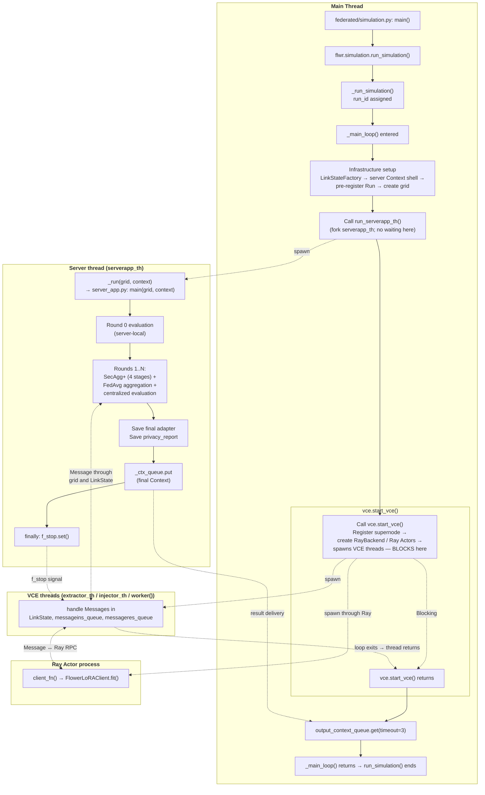
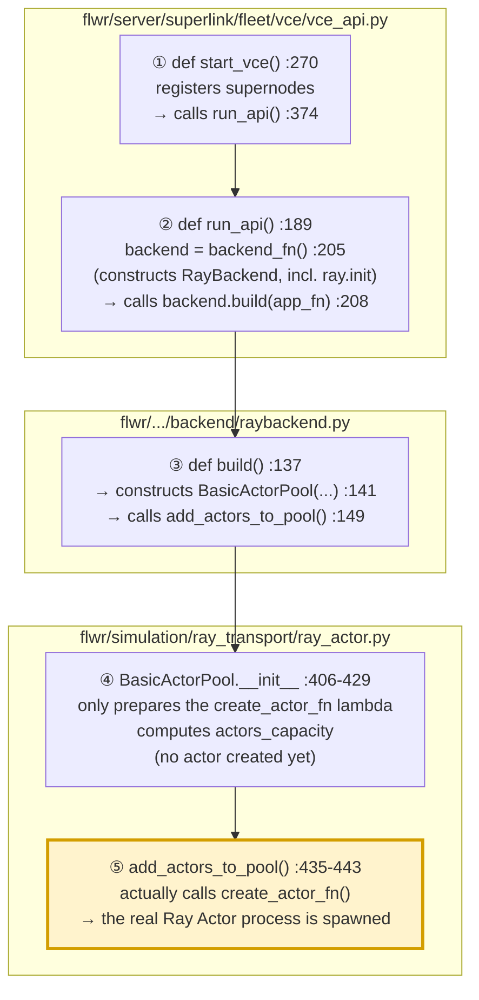
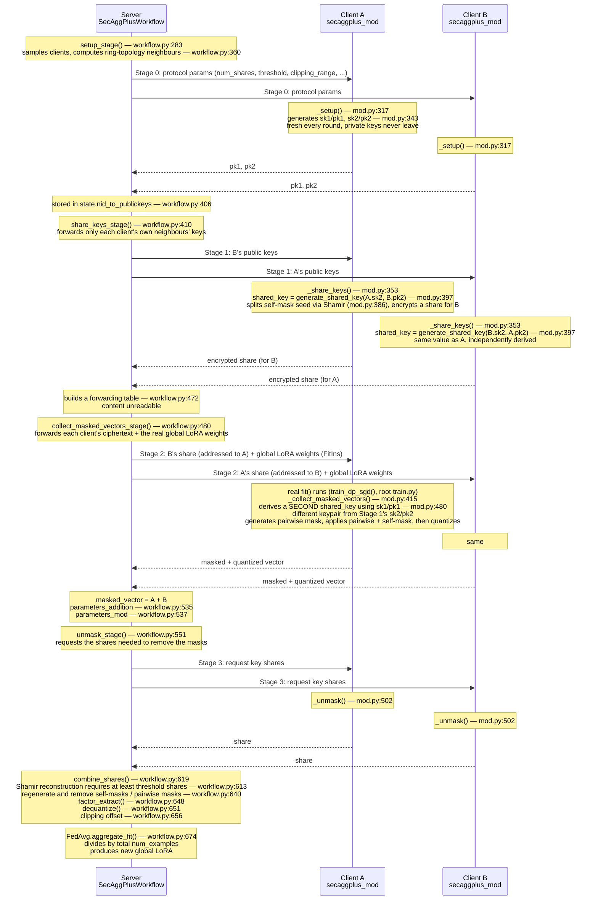

# 1. Flower (InMemory) Simulation Flow

This describes the complete simulation execution flow, from the invocation of `run_simulation()` to the final termination of the simulation. The workflow is divided across the main thread running `_main_loop()`, the serverapp_th thread, and the Ray actor process involved in client-side processing. Communication between serverapp_th and the Ray Actor process is handled by threads spawned by the Virtual Client Engine (VCE).

All flwr references below are based on the installed `flwr==1.30.0` (installed at `.../site-packages/flwr/`).

---

## 1) Simulation Overview Diagram



---

## 2) Thread Description

### a) Main Thread

The main thread acts as the top-level orchestrator of the simulation, setting up the shared state, spawning the server thread, and then blocking within the VCE while the server-side and client-side execution proceed concurrently.

First, `federated/simulation.py: main()` calls `run_simulation()`. `run_simulation()` logs a deprecation warning and delegates execution to `_run_simulation()`. `_run_simulation()` generates a random `run_id` using `generate_rand_int_from_bytes`, wraps it in a mostly empty `Run` object, and then calls `_main_loop()`.

Inside `_main_loop()`, the simulation environment is prepared through four operations:

* `LinkStateFactory(...)`: creates the shared, backend-swappable message and node store.
* A server-side `Context` shell is created with node_id=0.
* The `Run` is pre-registered in the `LinkState`.
* `grid` is constructed via `InMemoryGrid(state_factory=state_factory)`.

The server-side `Context` is created with `run_config=UserConfig()`, which is an empty dictionary. This is why `federated/config.py` reads `pyproject.toml` instead of relying on `Context.run_config`.

`InMemoryGrid` serves as a message-passing interface that reads from and writes to the same `LinkState` object.

Afterward, `run_serverapp_th()` spawns `serverapp_th` and returns immediately. The main thread does not wait for `serverapp_th` at this point. This is where the two execution paths represented by the `main thread` and `server thread` branch into concurrent execution.

In the `main thread`, `vce.start_vce(...)` blocks until the simulation is nearly complete. Internally, `start_vce()` calls `run_api()`, which eventually waits on `.join()` calls. It also contains a with `ThreadPoolExecutor(): ...` block whose `__exit__` waits for every submitted `worker()` to finish.

The VCE threads remain inside loops governed by `while not f_stop.is_set():`. They exit only after `f_stop` is set, which does not occur until `serverapp_th` has completed all simulation rounds.

Within `vce.start_vce(...)`, `_register_nodes()` assigns each of the `num_supernodes`:

* a random node_id, and
* a sequential partition-id.

These mappings are stored in `LinkState` and in a separate `node_info_stores` dictionary.

After node registration, `RayBackend.__init__()` / `build()` initializes Ray and creates the actor process or processes. The actor pool size is determined by `pool_size_from_resources()` based on `client_resources`. In the normal configuration, the GPU count is the binding constraint, so one GPU results in one actor.

The VCE then starts three types of engine execution `extractor_th`, `injector_th`, and `worker()`. `extractor_th` polls LinkState every 0.1 seconds. `injector_th` blocks on a standard Queue and writes replies back into `LinkState`. Each `worker()` blocks on: `messageins_queue.get(timeout=1.0)`. When a worker receives a message, it synchronously calls `backend.process_message()`

All three execution paths independently loop while monitoring the same shared `f_stop` `threading.Event`. They do not wait for one another directly. Their common synchronization mechanism is the shared `f_stop` event.

Once `f_stop` is observed, the VCE engine loops terminate and `vce.start_vce()` returns, which unblocks the main thread.

The main thread then executes `output_context_queue.get(timeout=3)`. This retrieves the final `Context` that `serverapp_th` has already deposited into the queue at step *N*. 

Finally, `_main_loop()` returns that `Context`, which becomes the result of `run_simulation()`. 

### b) Server Thread (serverapp_th)

The server thread is responsible for executing the server-side federated learning workflow. It runs the `ServerApp`, coordinates each round through the `grid` object, and signals the VCE to shut down once the simulation is complete. 

First, `_run(grid, context)` invokes `server_app.py: main(grid, context)`, which performs SecAgg+ and FedAvg. 

If the number of rounds defined by the user is **N**, the server executes a total of **N+1 rounds**, including Round 0. 

Before SecAgg+ begins, Round 0 performs only a server-local evaluation. There is no client communication at this stage. 

For Rounds 1 through N, each round runs a fresh `SecAggPlusWorkflow` consisting of four stages: 

`setup → share_keys → collect_masked_vectors → unmask` 

No SecAgg+ state is carried over between rounds. 

After these four stages, the server performs `FedAvg` aggregation followed by centralized evaluation on held-out data. 

All communication with the clients passes through the `grid` object. 

Furthermore, the `serverapp_th` wrapper first places the final `Context` into `output_context_queue` and then sets `f_stop`. `output_context_queue` is a `Queue` used to hand off data between threads, while `f_stop` is a `threading.Event` used as a shutdown signal. Setting this event allows the VCE loops to terminate, eventually causing `start_vce()` to return.

### c) VCE Threads

Within `vce.start_vce()`, `run_api()` starts three types of client-side execution:

- **`extractor_th`** — Polls `LinkState.get_message_ins(node_id, limit=1)` for each registered node every 0.1 seconds and moves any pending messages into `messageins_queue`. This is polling rather than an event-driven wakeup: `LinkState` does not expose a notification mechanism, allowing the same interface to work across different backends, such as in-memory, SQL, or a remote SuperLink.

- **`worker()`** — One worker is created per backend actor (`backend.num_workers == self.pool.num_actors`) and submitted through a `ThreadPoolExecutor`. Each worker blocks on `messageins_queue.get(timeout=1.0)`, which uses an underlying `threading.Condition`. A worker is therefore woken promptly when `extractor_th` calls `put()`, rather than periodically re-checking the queue on a fixed schedule.

- **`injector_th`** — Blocks on `messageres_queue.get(timeout=1.0)` and writes each response produced by a `worker()` back into `LinkState.message_res_store`, from which the server side eventually retrieves it through `grid.pull_messages()`.

**Remark.** Each client-side invocation begins when a `worker()` dequeues a message from `messageins_queue`. The worker then calls `backend.process_message()`, which invokes `actor.run.remote(...)` and blocks on `ray.get()` until the actor returns.

Because `num_workers == num_actors` and each worker follows this synchronous submit-and-block pattern, the implementation appears to prevent multiple concurrent calls from being issued to the same actor. This point should be verified against the actor-pool scheduling logic.


### d) Ray Actor processes

The actor is a single persistent OS process reused across rounds and clients. However, `FlowerLoRAClient` is rebuilt from scratch on every activation. What persists across activations is:

* the 7B model / LoRA scaffold, and
* each client's own `Context`.

Client `Context` objects are never shared between clients, even though those clients reuse the same actor process.

---

# 2. How Flower spawns Ray Actor processes

Flower does not directly create a new operating-system process for each `ClientAppActor`. Instead, Ray first initializes its runtime and prepares a pool of idle worker processes. Flower then builds its actor-management layer on top of this existing Ray worker pool.

The process begins when `ray.init()` is called inside `RayBackend.__init__`. At this point, Ray starts its worker infrastructure and makes idle worker processes available before Flower has created any actors. Flower then constructs `BasicActorPool`, whose initialization only defines how actors should be created and how many can be accommodated based on the requested resources. No worker process is assigned to a Flower actor at this stage.

Actual actor creation occurs later, when `add_actors_to_pool()` invokes the actor creation function and ultimately calls `.remote()`. This is the point at which Ray assigns an available worker process to a `ClientAppActor` and initializes the actor inside that process. Because Ray actor creation is asynchronous, Flower receives an actor handle immediately while the actor initialization completes in the worker process.

Conceptually, the sequence is:

`Ray worker processes are prepared → Flower configures the actor pool → Flower requests actor creation → Ray assigns workers to ClientAppActor instances`

The following steps trace this process from `ray.init()` through the creation of each `ClientAppActor`.

---

## 1) The Call Relay

This traces the call chain from `vce.start_vce()` down to the moment a Ray Actor process is spawned.



---

## 2) Actor Initialization Flow: Steps 2, 3, 4, and 5

### a) Step ② — `backend_fn()` constructs `RayBackend`, which calls `ray.init()` and pre-spawns the idle worker pool

  ```python
  # raybackend.py:43-53 (RayBackend.__init__, invoked by backend_fn() at run_api.py:205)
  def __init__(self, backend_config: BackendConfig) -> None:
      """Prepare RayBackend by initialising Ray and creating the ActorPool."""
      log(DEBUG, "Initialising: %s", self.__class__.__name__)
      log(DEBUG, "Backend config: %s", backend_config)

      self.init_args_key = "init_args"
      self.init_ray(backend_config)   # <- calls ray.init(...) if not already initialised

      self.client_resources_key = "client_resources"
      self.client_resources = self._validate_client_resources(config=backend_config)
      self.actor_kwargs = self._validate_actor_arguments(config=backend_config)
      self.pool: BasicActorPool | None = None
      self.app_fn: Callable[[], ClientApp] | None = None
  ```

  `self.init_ray(backend_config)` calls `ray.init(...)` under the hood (skipped if a Ray runtime already exists).

### b) Step ③ — `RayBackend.build()` constructs `BasicActorPool`

  ```python
  # raybackend.py:137-152
  def build(self, app_fn: Callable[[], ClientApp]) -> None:
      """Build pool of Ray actors that this backend will submit jobs to."""

      try:
          self.pool = BasicActorPool(
              actor_type=ClientAppActor,
              client_resources=self.client_resources,   # e.g. {"num_cpus": 1.0, "num_gpus": 1.0}
              actor_kwargs=self.actor_kwargs,           # {} in this project
          )
      except Exception as ex:
          raise ex
  
      self.pool.add_actors_to_pool(self.pool.actors_capacity)
      self.app_fn = app_fn
      log(DEBUG, "Constructed ActorPool with: %i actors", self.pool.num_actors)
  ```

  - `actor_type=ClientAppActor` — the `@ray.remote`-decorated class to use as the actor.
  - `client_resources` — the per-actor resource reservation from the `backend_config` set in `federated/simulation.py`.
  - `BasicActorPool(...)` triggers its `__init__` — this is step **④**.
  - `self.pool.add_actors_to_pool(self.pool.actors_capacity)` — this is step **⑤**.

### c) Step ④ — `BasicActorPool.__init__` registers `create_actor_fn`

  ```python
  # ray_actor.py:406-429
  def __init__(self, actor_type, client_resources, actor_kwargs):
      self.client_resources = client_resources

      # Queue of idle actors
      self.pool: list[VirtualClientEngineActor] = []
      self.num_actors = 0

      actor_args = {} if actor_kwargs is None else actor_kwargs
  
      # A function that creates an actor
      self.create_actor_fn = lambda: actor_type.options(
          **client_resources
      ).remote(**actor_args)

      self.actors_capacity = pool_size_from_resources(client_resources)
      self._future_to_actor: dict[Any, VirtualClientEngineActor] = {}
  ```
                                                                                                                                                                                                                                                                 
  - `self.pool = []` — the idle-actor queue.
  - `self.create_actor_fn = lambda: ...` — this is the key line for registration. `actor_type`, `client_resources`, and `actor_args` are captured from this scope and bundled inside the lambda. **Nothing is created yet at this point** — this only stores a recipe for creating an actor later.
  - `self.actors_capacity = pool_size_from_resources(client_resources)` — a separate helper (`ray_actor.py:86-141`) inspects the live Ray cluster (`ray.nodes()`) and computes how many actors can fit given the per-actor resource request.
  - `self._future_to_actor = {}` — an empty bookkeeping table (not a results container) that will later map a pending Ray future to the actor handling it, so a busy actor can be identified and returned to the idle queue once its task completes.

### d) Step ⑤ — `add_actors_to_pool()` calls the registered `create_actor_fn`

  ```python
  # ray_actor.py:435-443
  def add_actors_to_pool(self, num_actors: int) -> None:
      """Add actors to the pool.

      This method may be executed also if new resources are added to your Ray cluster
      (e.g. you add a new node).
      """

      for _ in range(num_actors):
          self.pool.append(self.create_actor_fn())  # type: ignore
      self.num_actors += num_actors
  ```
  
  Called as `self.pool.add_actors_to_pool(self.pool.actors_capacity)` from step **③**, i.e. with `num_actors=1` in a single-GPU setup.

  - `for _ in range(num_actors):` — loops once.
  - `self.create_actor_fn()` — the closure from step ④ is invoked for the first time. Its body now runs:
    - `actor_type.options(num_cpus=1.0, num_gpus=1.0)` — a local, synchronous step. Returns a newly configured wrapper carrying the resource request. No network or scheduling call happens here.
    - `.remote(**actor_args)` — the Ray Core call. This is asynchronous: it submits an actor-creation request to Ray's scheduler and returns an `ActorHandle`. Note that `ray.init()` (during `RayBackend.__init__`) already pre-spawns a pool of idle `ray::IDLE` worker processes, one per (logical) CPU slot. Ray's scheduler claims one of those already-running idle processes and repurposes it to host the `ClientAppActor` instance; `ClientAppActor.__init__` then runs inside that claimed process, but only once Ray gets around to it — asynchronously, after `.remote()` has already returned.
  - `self.pool.append(...)` — the returned `ActorHandle` is pushed into `self.pool`, which was empty since step ④. This is the first moment `self.pool` becomes non-empty — but note that "non-empty" only means a handle now exists in the list, not that the actor behind it has finished initializing (see the timing measurements below).
  - `self.num_actors += num_actors` — updates the count once, after the loop.

---


# 3. SecAgg+ and FedAvg




---

**Writer:** Youngmok Ha (y.ha25@imperial.ac.uk)